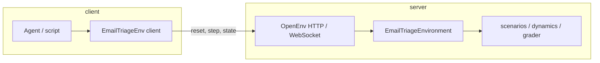

# EmailTriageEnv

**Train and evaluate agents on a realistic support-inbox triage loop**—SLAs, partial visibility, action costs, and dynamic arrivals—inside a proper **OpenEnv** server with HTTP, WebSocket, Docker, and optional **Hugging Face Spaces** deployment.

> *One pending email per step: **reply**, **escalate**, or **archive**. The world keeps ticking. You only see the top of the queue.*

---

## In this README

| Section | You’ll find |
|---------|-------------|
| [Why this matters](#why-this-matters) | Who it’s for and what gap it fills |
| [What you get](#what-you-get-out-of-the-box) | Features and design choices at a glance |
| [How it works](#how-it-works) | Lifecycle, observability, scoring |
| [Benchmarks](#benchmarks) | Three tasks, task graders |
| [Quick start & deploy](#quick-start) | Code, Docker, Hugging Face |
| [Reference](#reference-action--observation--reward) | Schemas, modules, logging |

---

## Why this matters

**Real operations don’t look like static classification.** A support or copilot agent must prioritize under deadlines, avoid burning the escalation path, write acceptable customer-facing text, and keep working while **new work arrives**. Most toy benchmarks fix the input set and hide none of the tradeoffs.

**EmailTriageEnv** compresses that story into a **deterministic, reproducible** simulator:

- **Virtual time** and **SLA breaches** punish procrastination and wrong ordering.
- **Top‑N visibility** forces policies to reason under **partial observability** (urgent mail can sit outside the visible slice until it surfaces).
- **Per-action costs and durations** make “always escalate” and “always reply” both suboptimal in different ways.
- **Optional seeded arrivals** turn the inbox into a **non-stationary** stream for harder evaluation.

That combination is **useful for research and product-facing benchmarks**: RL, preference optimization, and **LLM-driven** agents can all target the same environment and **compare on the same three graded tasks** without leaking answer keys into observations.

---

## What you get out of the box

| Capability | Detail |
|------------|--------|
| **OpenEnv-native** | `EmailTriageEnv` client + `EmailTriageEnvironment` server; `reset` / `step` / `state`; `POST` + `WS /ws`. |
| **Fair evaluation** | `PublicEmail` in observations; **`ground_truth_action`** and **keyword rubrics** stay server-side unless you explicitly expose them in state. |
| **Dense, interpretable signal** | Per-step **`reward`** in **[0, 1]** plus **`metadata["grade"]`**. **`legacy`** / **`hybrid`** use range normalization over the legacy-style sum; **`emergent`** uses a fixed map **`(base + 0.6) / 1.2`** (clipped) with **no** oracle action term and a **`consequence_signal`** field (see [Per-step reward](#per-step-reward-summary)). |
| **Episode benchmarks** | Three **`TaskSpec`** graders in **`tasks.py`** (easy → medium → hard), each scoring **[0, 1]** independently of the mean step reward. |
| **LLM runner** | Repo **`inference.py`**: structured **`[START]` / `[STEP]` / `[END]`** logs for leaderboard-style runs. |
| **Shipping** | `uv` + lockfile, **Dockerfile**, **`openenv push`** path for HF Spaces, web UI at `/web`. |

**Threads, entanglement, and extra mail:** `thread_id` groups mail; **`thread_reply_excerpt`** surfaces your last reply in that thread on visible rows. When **`entanglement_enabled`** is on, the server **mutates existing pending rows in place** (no new emails): a **reply** lowers urgency for other pending mail in the same thread; an **escalate** tightens **`sla_limit`** for other pending mail from the **same sender**; a **wrong archive** (action archive but label ≠ archive) bumps **`sla_pressure_offset`** for grading **and** tightens **`sla_limit`** on the two most urgent **hidden** pending items. Separately, **stochastic follow-ups** (after reply) and **internal echo** mail (after escalate) may **append** new rows. **`legacy`** / **`hybrid`** reply scoring uses **keywords plus light structure**; **`emergent`** uses only **length + punctuation** for the reply term. None of this replaces human judgment for production rubrics.

---

## How it works

### Architecture



| Layer | Role |
|--------|------|
| **`EmailTriageEnv`** (`client.py`) | Serializes `MyAction`, parses `StepResult[MyObservation]`, one WebSocket session per server env instance. |
| **`server/app.py`** | `create_app(EmailTriageEnvironment, …)` → `POST /reset`, `POST /step`, `GET /state`, `GET /schema`, `WS /ws`. |
| **`EmailTriageEnvironment`** | RNG, full inbox, virtual time, config; `reset` / `step`. |
| **`scenarios.py`** | `starter_inbox()` for profile **0**; **`generate_starter_inbox(seed, profile)`** for **1–15** — **parametric** bands (low / medium / high complexity) with **`random.Random(seed)`** only so results are independent of the env RNG. `arrival_templates()`. |
| **`consequences.py`** | **`apply_entanglement_state_mutations`** (in-place pending updates when **`entanglement_enabled`**); optional **follow-ups** after **reply** and **echo** mail after **escalate** (env RNG). |
| **`dynamics.py`** | Urgency ranking (**`low` / `medium` / `high` / `critical`**, plus per-email **`urgency_adjustment`**), top‑N slice, time advance, optional arrivals (biased after **reply/escalate** in-thread). |
| **`grader.py`** | `grade_step` → **`GradeBreakdown`** (includes **`consequence_signal`**); env applies **`normalize_step_reward_to_unit`** for **`legacy`** / **`hybrid`** only; **`emergent`** uses the breakdown **`total`** as **`reward`** directly. |
| **`tasks.py`** | Episode-level **`TaskSpec.grader`** (harness), separate from per-step reward. |

State changes only through **`reset`** and **`step`**. **`state()`** is for inspection; by default grader labels are stripped so RL runs don’t see the answer key—set **`expose_grader_labels_in_state: true`** in **`EnvConfig`** when you need full rows.

### Episode lifecycle

**Reset:** Load **`EnvConfig`**, seed the environment RNG when **`seed`** is set. **`scenario_profile == 0`** → deep copy of fixed **`starter_inbox()`** (benchmark default). **`1–15`** → **`generate_starter_inbox(seed, profile)`**: **parametric** inbox (count, priorities including **`critical`** in the high band, SLAs, thread clusters, senders from a fixed pool, weighted ground truth, sampled keywords for replies)—all driven only by **`random.Random(int(seed))`**, not by other RNG calls. Reset **`thread_replies`**, **`sla_pressure_offset`**, breach counter, and fresh emails (no carry-over mutations). Return top‑N pending by urgency plus **`hidden_pending_count`**.

**Valid step:** Grade at **current** time (before advance) using effective SLA for the chosen row (**`sla_limit`** minus **`sla_pressure_offset`**). Update breach counter, thread-reply cache, and (on wrong archive) **`sla_pressure_offset`** when entanglement is on. Run **`apply_entanglement_state_mutations`** on the live inbox (reply / escalate / wrong-archive branches). **Then** mark the chosen email processed, advance the clock, append optional **follow-up / echo** messages, run **templated arrivals**, and return the new top‑N plus **`metadata.grade`** (includes **`consequence_signal`**), **`metadata.new_emails`**, **`episode_stats`**.

**Invalid step** (bad or stale `email_id`): Time still moves; strong negative reward; **`metadata.error`** = `invalid_email_id_or_not_pending`.

**SLA** is evaluated at **step start**; new mail gets **`created_time`** equal to the clock **after** the step’s time advance.

**Arrivals:** Seeded draws; probability a bit higher early in the episode; at most one new email per valid step when enabled.

### Observability and urgency

Only **pending** mail appears in **`inbox`**. Urgency blends **priority** (**`low` … `critical`**), **customer tier**, **remaining SLA**, and any server-side **`urgency_adjustment`** from past thread replies. The agent sees the **top `top_n`** by that score—not FIFO—so hidden mail can breach SLA if the policy ignores the global picture. **`sla_limit`** on **`PublicEmail`** is the visible deadline width; escalations and bad-archive entanglement can **change** those limits on other pending rows so the queue **reshapes** without new messages.

### Per-step reward (summary)

Three **`reward_mode`** values:

| Mode | Oracle action match | Reply term | Extra terms | Scalar **`reward`** |
|------|---------------------|------------|-------------|---------------------|
| **`legacy`** | Full weight (0.3 if match) | Keywords + structure | None (no throughput / breach-load) | Normalized via **`normalize_step_reward_to_unit`** |
| **`hybrid`** | Scaled by **`oracle_weight`** | Keywords + structure | Throughput bonus, breach-load penalty (non-oracle) | Same normalization as legacy |
| **`emergent`** | **Removed** | **Length > 20** and **punctuation** (any of **`. , ! ?`**) only—**no** keyword/oracle | **`consequence_signal`** only: e.g. reply with hidden backlog, critical escalate with low SLA remaining, penalty for archiving **high/critical** | **`(base + 0.6) / 1.2`** clipped to **[0, 1]**—**not** passed through **`normalize_step_reward_to_unit`** |

**`metadata["grade"]`** always includes **`consequence_signal`** (0 in **`legacy`** / **`hybrid`**). **`emergent`** omits idle cost in the sum; **`legacy`** / **`hybrid`** keep per-step idle penalty.

### Task score vs mean step reward

**Training:** Policies typically **optimize the scalar `reward`** each step (still in **[0, 1]** for all modes; mapping differs for **`emergent`** as above). A **rubric** hook can still override **`observation.reward`**. **Task score** (in **`tasks.py`**) is a **separate episode-level report card**—often **oracle-aware**—so it **need not** track **`emergent`** step rewards. Use **`legacy`** for the original oracle-heavy shape; **`hybrid`** (default) for a tunable blend (**`oracle_weight`**); **`emergent`** to train on observable cues and **`consequence_signal`** without ground-truth action in the step reward.

---

## Benchmarks

Three tasks, **[0, 1]** scores, **deterministic** under fixed seeds:

| Task ID | Difficulty | Max steps | What it tests |
|---------|------------|-----------|----------------|
| `easy_single_urgent_first` | Easy | 1 | Pick the **most urgent visible** mail and the **right** action first try. |
| `medium_sla_safe_throughput` | Medium | 30 | Clear the queue with **few SLA breaches**, **correct actions**, **limited escalation**. |
| `hard_dynamic_arrivals_backlog` | Hard | 30 | Same pressures **plus** **new mail**—latency to first handle of arrivals matters. |


Repo-root **`inference.py`** drives an **LLM** against a live server and prints **`[START]` / `[STEP]` / `[END]`** lines. **`success=true`** only when the **task** grader returns a perfect **1.0**—strong step rewards alone are not enough.

---

## Quick start

**Python 3.10+**, from this package root (e.g. `envs/email_triage_env`):

```bash
uv sync
uv run server
# or: uvicorn email_triage_env.server.app:app --host 0.0.0.0 --port 8000
```

Default URL: **`http://localhost:8000`** (`openenv.yaml`).

The client is **async**:

```python
import asyncio
from email_triage_env import EmailTriageEnv, MyAction


async def main():
    async with EmailTriageEnv(base_url="http://localhost:8000") as env:
        result = await env.reset(
            config={"top_n": 3, "seed": 1, "arrivals_enabled": True, "max_new_emails": 2}
        )
        print(f"current_time={result.observation.current_time} visible={len(result.observation.inbox)}")

        first = result.observation.inbox[0]
        result = await env.step(
            MyAction(
                email_id=first.email_id,
                action_type="reply",
                response="Thanks — we’ll investigate and share an ETA.",
            )
        )
        print(f"reward={result.reward} done={result.done}")


asyncio.run(main())
```

Use **`EmailTriageEnv.from_docker_image(...)`** (async) to start a container, connect, and **`close()`** when done.

### Docker

From **this directory** (`pyproject.toml` + `server/Dockerfile`):

```bash
docker build -t email-triage-env:latest -f server/Dockerfile .
```

From **monorepo root** (context = whole repo):

```bash
docker build -f envs/email_triage_env/server/Dockerfile --build-arg SOURCE_DIR=envs/email_triage_env -t email-triage-env:latest .
```

Use a repo-root **`.dockerignore`** that excludes **`**/.venv/`** so host virtualenvs are not copied into the image.

### Hugging Face Spaces

```bash
openenv push
# openenv push --repo-id username/space-name --private
```

Requires HF auth. After deploy: Space URL, **`/web`**, **`/docs`**, **`/health`**, **`/ws`**.

**Options:** `--directory`, `-d` · `--repo-id`, `-r` · `--base-image`, `-b` · `--private`

---

## Reference: action, observation, reward

### `MyAction` (`models.py`)

| Field | Type | Notes |
|--------|------|--------|
| `email_id` | `str` | Must be **pending**; invalid IDs waste time and hurt reward. |
| `action_type` | `reply` \| `escalate` \| `archive` | |
| `response` | `str` | In **`legacy`** / **`hybrid`**, reply scoring uses **keywords + structure** (server-side). In **`emergent`**, only **length + punctuation** contribute to the step reward. |

### `MyObservation`

| Field | Notes |
|--------|--------|
| `current_time` | After a step, reflects time **after** advance. |
| `inbox` | Up to **`top_n`** **`PublicEmail`**, urgency-sorted; **no** grader labels. |
| `hidden_pending_count` | Pending mail not shown. |
| `last_email_id`, `last_action_type`, `sla_breach`, `time_advance`, `action_cost` | Describe the **last** step. |
| `done` | No pending mail left. |
| `reward` | **[0, 1]** for all modes; **`emergent`** uses the grader’s clipped linear map, not the legacy min–max normalizer. |
| `metadata` | **`grade`** (includes **`consequence_signal`**), **`new_emails`**, **`episode_stats`** (`sla_breach_count`, `sla_pressure_offset`), or **`error`**. |

**`EnvConfig`** (at reset): `top_n`, `seed`, `scenario_profile`, `reward_mode`, `oracle_weight`, `arrivals_enabled`, `max_new_emails`, `thread_followups_enabled`, `escalation_echo_enabled`, `entanglement_enabled`, `bad_archive_pressure_delta`, `action_costs`, `per_step_idle_cost`, `action_durations`, `expose_grader_labels_in_state`.

**`PublicEmail` vs `Email`:** Observations use **`PublicEmail`** (**`thread_id`**, **`thread_reply_excerpt`**, **`priority`** including **`critical`**). Server-only on **`Email`**: **`ground_truth_action`**, **`required_response_keywords`**, **`sender`** (for sender-based entanglement), **`thread_context_updated`**, **`urgency_adjustment`**—these never appear in observations or default **`state()`**. **`GET /state`** strips labels unless **`expose_grader_labels_in_state: true`**.

**`MyState`:** Full clock, all emails, config, arrival counter, **`thread_replies`**, **`sla_pressure_offset`**, **`episode_sla_breach_count`**.

**`training_utils.py`:** **`slot_action_to_my_action`**, **`flat_index_to_slots`**, **`ACTION_KINDS`** for discrete RL spaces.

### Server modules

| File | Role |
|------|------|
| `email_triage_environment.py` | Orchestrates reset / step / state. |
| `scenarios.py` | Fixed **`starter_inbox()`** + **parametric** **`generate_starter_inbox`** + arrival templates. |
| `consequences.py` | In-place **entanglement** mutations + optional follow-ups and escalation echoes. |
| `dynamics.py` | Urgency, top‑N, time, arrivals. |
| `grader.py` | **`grade_step`** → **`GradeBreakdown`**. |

### Structured stdout (`inference.py`)

Repo-root **`inference.py`** runs an **LLM policy** only: each step the model sees the visible inbox and must return parseable JSON for **`MyAction`**. Configure **`OPENAI_API_KEY`** or **`HF_TOKEN`**, **`MODEL_NAME`** / **`OPENAI_MODEL`**, **`OPENAI_BASE_URL`** / **`ENV_BASE_URL`** as needed.

1. **`[START]`** — `task`, `env`, `model`  
2. **`[STEP]`** — `step`, `action`, `reward`, `done`, `error`  
3. **`[END]`** — `success` (perfect task score only), `steps`, `score`, `rewards` CSV  

Example:

```text
[START] task=easy_single_urgent_first env=email_triage_env model=openai/gpt-oss-120b:groq
[STEP]  step=1 action=reply('1','…') reward=0.61 done=false error=null
[END]   success=false steps=1 score=0.50 rewards=0.61
```

### Extending

Ideas: **open/read** actions; **assignee** on escalate; richer reply checklists; learned rubrics; carrying **sender** (or a hashed id) into **`PublicEmail`** if policies should see it without labels.

### OpenEnv rubric hook

If a **`rubric`** is installed on the environment, it can override **`observation.reward`** after **`grade_step`**. Default: built-in grader only.

### Advanced: existing server & concurrency

```python
from email_triage_env import EmailTriageEnv, MyAction

async def run():
    async with EmailTriageEnv(base_url="<ENV_HTTP_URL_HERE>") as client:
        result = await client.reset()
        result = await client.step(MyAction(email_id="1", action_type="reply", response="Hello!"))
```

For multiple concurrent WebSocket sessions, use **`EmailTriageEnvironment`** as a **class** in **`create_app`** and raise **`max_concurrent_envs`** in **`server/app.py`**.

### Development

```bash
python -c "from server.email_triage_environment import EmailTriageEnvironment; EmailTriageEnvironment()"
openenv validate
```

### Monorepo imports

```python
from envs.email_triage_env.client import EmailTriageEnv
from envs.email_triage_env.models import MyAction
```

---

## Project structure

```
email_triage_env/
├── .dockerignore
├── __init__.py
├── README.md
├── openenv.yaml
├── pyproject.toml
├── uv.lock
├── training_utils.py
├── client.py
├── models.py
├── documentation.md      # stub → see README
├── explanation.md        # stub → see README
└── server/
    ├── app.py
    ├── email_triage_environment.py
    ├── scenarios.py
    ├── consequences.py
    ├── dynamics.py
    ├── grader.py
    └── Dockerfile
```

---

*EmailTriageEnv: a compact, reproducible inbox for agents that need to do more than classify a fixed list—prioritize, commit, and keep up when the queue moves.*
