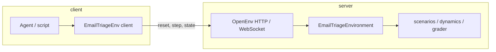

# EmailTriageEnv: End-to-end flow, rewards, and graders

This document describes how **EmailTriageEnv** (client) and **EmailTriageEnvironment** (server) work from **outside in** (client → server → state) and **inside out** (state → observation → reward → metadata). It complements `documentation.md`, which lists schemas and API surfaces in more reference style.

---

## 1. System boundaries

| Layer | Role |
|--------|------|
| **`EmailTriageEnv` client** (`envs/email_triage_env/client.py`) | Serializes `MyAction` to JSON, parses `StepResult[MyObservation]`, keeps a WebSocket session to one server-side environment instance. |
| **Server** (`envs/email_triage_env/server/app.py`) | OpenEnv `create_app(EmailTriageEnvironment, …)` exposes `POST /reset`, `POST /step`, `GET /state`, `GET /schema`, and `WS /ws`. |
| **`EmailTriageEnvironment`** (`envs/email_triage_env/server/email_triage_environment.py`) | Owns RNG, full inbox, virtual time, config; implements `reset` and `step`. |
| **Scenarios** (`envs/email_triage_env/server/scenarios.py`) | Starter inbox + arrival templates (content). |
| **Dynamics** (`envs/email_triage_env/server/dynamics.py`) | Urgency ranking, time advance per action, optional new arrivals. |
| **Grader** (`envs/email_triage_env/server/grader.py`) | Per-step scalar reward breakdown (`GradeBreakdown`). |
| **Tasks** (`envs/email_triage_env/tasks.py`) | Optional **episode-level** scores that aggregate trajectories (evaluation harness), separate from per-step reward. |

The agent never mutates server state except through **`reset`** and **`step`**. **`state`** returns `MyState` (config, clock, emails). By default, emails omit grader-only fields so clients can call **`state()`** during RL without leaking the answer key; set **`expose_grader_labels_in_state`** in `EnvConfig` when you need full rows (e.g. inspection).

---

## 2. Data you pass in and get back

### 2.1 Action (`MyAction`) — input to each step

- **`email_id`**: Must refer to a **pending** email in the full inbox (not only visible).
- **`action_type`**: `reply` \| `escalate` \| `archive`.
- **`response`**: Text used when `action_type == "reply"` for the response-quality part of the grader.

### 2.2 Observation (`MyObservation`) — output of reset and step

- **`current_time`**: Virtual clock **after** any time advance in a `step` (on reset, initial time is `0`).
- **`inbox`**: Up to **`top_n` pending** **`PublicEmail`** rows (no `ground_truth_action` or keyword labels), sorted by **urgency** (not arrival order). Partial observability: other pending emails exist but are not listed.
- **`hidden_pending_count`**: `len(pending) - len(visible)` (capped at non-negative).
- **`reward`**: Scalar for the last step (see §5). On reset, reward is typically unset/`None` depending on transport.
- **`done`**: `True` when there are **no pending** emails left.
- **`sla_breach`**, **`time_advance`**, **`action_cost`**: Describe the **last** step’s SLA outcome and costs.
- **`metadata`**: On successful valid steps, includes **`grade`** (full breakdown dict) and **`new_emails`** (ids of emails injected this step). On invalid selection, **`error`**.

### 2.3 State (`MyState`) — full picture (via `GET /state` or client `state()`)

- **`emails`**: full list (including processed). Grader labels are **stripped** unless **`expose_grader_labels_in_state`** is `true`.
- **`current_time`**, **`config`**, **`new_emails_added`**, episode ids, step count.

---

## 3. Reset flow

1. Parse **`EnvConfig`** from `reset` kwargs (`config` dict), e.g. `top_n`, `seed`, `arrivals_enabled`, `max_new_emails`, cost knobs.
2. If **`config.seed`** (or `seed` argument) is set, seed the environment RNG so arrivals and any stochastic choice repeat.
3. Replace inbox with a **deep copy** of **`starter_inbox()`** from `scenarios.py` — all starter emails are **pending**.
4. Set **`current_time = 0`**, reset counters.
5. Build observation: compute **top-N pending** by urgency (§4), set **`hidden_pending_count`**, **`done`** if nothing pending.

**Example:** `reset(config={"top_n": 3, "seed": 2, "arrivals_enabled": true, "max_new_emails": 3})`  
→ Starter emails load as usual; later steps may add up to three new emails total; only three pending rows show at once (plus hidden count).

---

## 4. Urgency, visibility, and “what the agent sees”

**Pending** emails are those with `status == pending`. **Processed** emails leave the queue and never appear in `inbox`.

**Urgency** (`dynamics.urgency_score`) combines:

- Priority weight (high \> medium \> low),
- Customer tier weight (vip \> premium \> standard),
- Time pressure: less **remaining SLA** → higher urgency.

The top **`max(1, top_n)`** pending emails by this score appear in **`observation.inbox`**. The agent might not see a very urgent email until it enters the top-N — or if it mis-orders work, SLA breaches can occur on emails that were hidden earlier.

**Example:** With `top_n = 3` and five pending emails, **`hidden_pending_count`** is `2`. The visible list is the three most urgent **right now**, not the three oldest.

---

## 5. Step flow (valid action)

Sequence for one **valid** step (chosen id exists and is pending):

1. **Snapshot** `pending_before` for grading.
2. **`grade_step(...)`** at **current** `current_time` (before time advances for this action) — §6.
3. Mark chosen email **`processed`**.
4. Increment **`step_count`**, advance **`current_time`** by **`action_durations[action_type]`** (defaults: reply 2, escalate/archive 1; minimum 1).
5. **`maybe_generate_arrivals`**: if enabled and budget allows, RNG may add **one** new email from **`arrival_templates()`**; assign next `email_id`, `created_time = current_time` after advance.
6. Build next observation: recompute top-N pending, **`metadata.grade`**, **`metadata.new_emails`**.

**Reward** for the step is **`GradeBreakdown.total`** (unless a custom **rubric** override is installed on the environment).

---

## 6. Per-step grader and reward (`grader.grade_step`)

The scalar **`reward`** is a sum of components. Intuition: **be on time**, **pick the most urgent email**, **match the labeled action**, **write an acceptable reply when replying**, and pay **configurable costs**.

| Component | Meaning | Typical contribution |
|-----------|---------|----------------------|
| **SLA** | `(current_time - created_time) > sla_limit` → breach; heavy penalty vs small bonus if not breached | `+0.5` or `-1.0` |
| **Prioritization** | Chosen email equals **single** “best” pending by `urgency_score` | `+0.4` or `0` |
| **Action correctness** | `action_type == email.ground_truth_action` | `+0.3` or `0` |
| **Response** | For `reply`: fraction of **required_response_keywords** found in `response` (scaled); if no keywords required, length proxy (≥12 chars → partial score). Non-reply → `0` for this part | up to `+0.3` |
| **Costs** | `-action_costs[action_type]` and `-per_step_idle_cost` | negative or zero |

All of this is **deterministic** given state, action, and config.

### 6.1 Worked example (illustrative numbers)

Assume **`current_time = 0`**, one pending email **A** (`created_time = 0`, `sla_limit = 5`), and it is the only pending mail, so it is both **visible** and **best**.

- Agent: **`escalate`** on A, empty `response`.
- SLA: `(0 - 0) > 5` → false → **sla_score = +0.5**
- Prioritization: chosen is best → **+0.4**
- Action: if `ground_truth_action == "escalate"` → **+0.3**
- Response: not a reply → **0**
- Costs: e.g. escalate `0.15` + idle `0.01` → **-0.16**

**Total ≈ 0.5 + 0.4 + 0.3 - 0.16 = 1.04** (exact value follows `EnvConfig` defaults).

If the same email were acted on at **`current_time = 6`** with `sla_limit = 5`: `(6 - 0) > 5` → **breach** → **sla_score = -1.0**, wiping most of the upside unless other components still apply.

---

## 7. Step flow (invalid action)

If **`email_id`** is missing or not **pending** (wrong id, already processed):

- **No** `grade_step` on a real email.
- Time still advances using **`action_durations`** for the **declared** `action_type`.
- **Reward** ≈ **`-1.0 - action_cost - per_step_idle_cost`** (see `email_triage_environment.py`).
- **`metadata.error`** = `"invalid_email_id_or_not_pending"`.

So invalid actions waste time and can let **SLA** slip on emails the agent did not handle.

---

## 8. Virtual time and SLA

- **SLA breach** in the grader uses **time at the start of the step** (before advancing for the action).
- **New arrivals** use **`created_time = current_time`** **after** that advance, so new mail “appears” in the future relative to old mail’s timeline.

**Example:** Replying takes longer (default 2 ticks) than archiving (1). Choosing **reply** on many items burns more virtual time and can cause more breaches on remaining pending mail.

---

## 9. Dynamic arrivals

When **`arrivals_enabled`** and **`max_new_emails`** allow:

- After each valid step, RNG may add **at most one** email sampled from **`arrival_templates()`**.
- Probability is higher early in the episode (`current_time < 5` vs later).
- **`metadata.new_emails`** lists ids added that step (used by the **hard** task grader for responsiveness).

Arrivals are **seeded** — same seed → same sequence of random draws **given the same sequence of valid/invalid steps** (invalid steps also advance RNG when they call into dynamics).

---

## 10. Two different “grading” concepts

| Layer | What it is | Where |
|--------|------------|--------|
| **Per-step reward** | Single scalar + `metadata["grade"]` from **`grade_step`** | Every **valid** `step` |
| **Task score** | Aggregates trajectory + **`observation_chain`** (post-step observations carry `grade`, `new_emails`, errors) | **`tasks.py`** — `TaskSpec.grader` |

Episode graders take **`observation_chain`**: `[obs_after_reset, obs_after_step_0, obs_after_step_1, …]`, so each step’s **`metadata`** is read from the observation **after** that step (not the pre-action snapshot stored in `trajectory`). Scripts such as **`inference.py`** build this chain and call **`task.grader(trajectory, final_state, observation_chain)`**. Task scores may **not** equal the sum of step rewards (e.g. the **hard** task uses responsiveness to new arrivals).

## 11. Training-oriented notes

- **Observations** never include grader labels; policies must use content, SLA pressure, and metadata rewards.
- **`GET /state`** strips labels by default (`expose_grader_labels_in_state=false`).
- **`training_utils`** maps flat or slot discrete actions to **`MyAction`** for RL toolkits that expect fixed spaces.

---

## 12. File map (quick reference)

| File | Responsibility |
|------|------------------|
| `models.py` | `MyAction`, `MyObservation`, `MyState`, `Email`, `EnvConfig` |
| `client.py` | Wire protocol parsing; `EmailTriageEnv` session |
| `server/app.py` | HTTP/WS app factory |
| `server/email_triage_environment.py` | `reset` / `step` orchestration |
| `server/scenarios.py` | `starter_inbox()`, `arrival_templates()` |
| `server/dynamics.py` | Urgency, top-N selection, time advance, arrivals |
| `server/grader.py` | `grade_step` → `GradeBreakdown` |
| `tasks.py` | `TaskSpec` definitions and episode graders |

---

## 13. Optional rubric hook

`EmailTriageEnvironment` inherits OpenEnv’s **`rubric`** mechanism: if set, **`observation.reward`** can be replaced by **`_apply_rubric`** after the normal breakdown. Default runs use the built-in **`grade_step`** total only.

---

*This file is descriptive of the implementation in this repository as of the time it was written; if behavior changes, verify against `email_triage_environment.py` and `grader.py`.*
